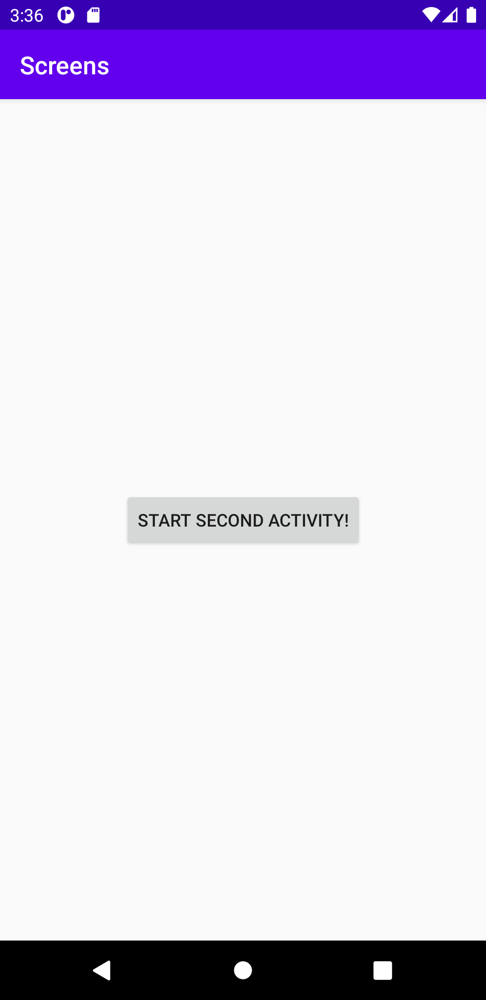
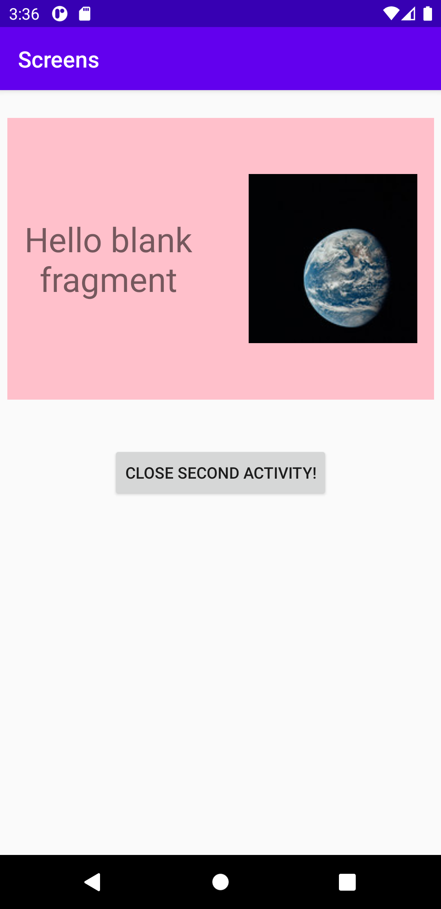

# Rapport Screens


En andra aktivitet lades till genom File -> New -> Activity. 


```java
Button button = findViewById(R.id.start);
        button.setOnClickListener(new View.OnClickListener() {
            @Override
            public void onClick(View v) {
                Intent intent = new Intent(MainActivity.this, SecondActivity.class);
                startActivity(intent);
                Log.d("TAG","Start activity");
            }
        });
```
**Figur 1**

En knapp skapades i activity_main layout som i MainActivity java filen hämtades med id. 
I figur 1 deklarerades och instansierades variabeln button och lade till en onclick lyssnare.
En intent deklarerades och instansierades med klassen från SecondActivity. På så vis kommer 
SecondActivity att öppnas vid knapptryck. 


```java
Button close = findViewById(R.id.close);
        close.setOnClickListener(new View.OnClickListener() {
            @Override
            public void onClick(View v) {
                Log.d("TAG", "Close activity");
                finish();
            }
        });
```
**Figur 2**

Ytterligare en knapp lades till, fast denna gång i SecondActivity för att kunna stänga 
aktiviteten och komma tillbaka till MainActivity. Knappen deklarerades och instansierades på samma 
sätt som i Figur 1 men denna gång körs funktionen finish() vid knapptryck istället enligt figur 2.


```java
<fragment
        android:name="com.example.screens.BlankFragment"
        android:layout_width="380dp"
        android:layout_height="250dp"
        android:tag="fragment_blank"
        app:layout_constraintBottom_toBottomOf="parent"
        app:layout_constraintLeft_toLeftOf="parent"
        app:layout_constraintRight_toRightOf="parent"
        app:layout_constraintTop_toTopOf="parent"
        android:layout_marginBottom="380dp"/>
```
**Figur 3**

Ett nytt fragment lades till genom File -> New -> Fragment.
Fragmentet lades till i SecondActivity layouten med android.name="fragmentet...". Fragmentet 
positionerades med constrainlayout och margin. Fragmentet stylades och redigerade textview 
elementet i fragmentets layout fil. Slutligen lades en image view till i fragmentets layout som
positionerades och stylades.


##Screenshots på färdig applikation



**Bild på MainActivity**



**Bild på SecondActivity med fragment**